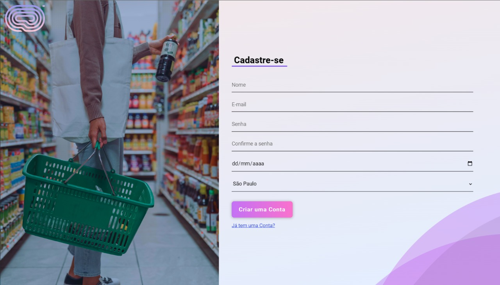
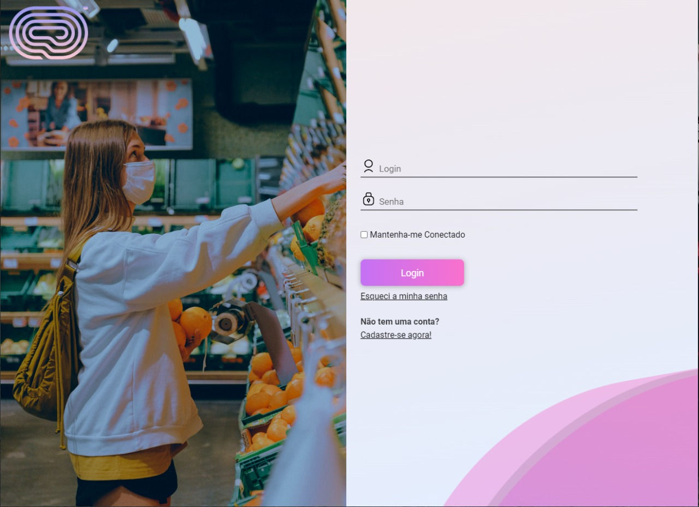

# listaMercado
**Projeto integrador Senac**

##
 
* Criado em PHP e JS, tem como o intuito listar as opções de compra do usuário e armazenar as informações do mesmo no banco de dados
 

> # Tela de Cadastro

* # Versão Mobile

##

> # Tela de Login

